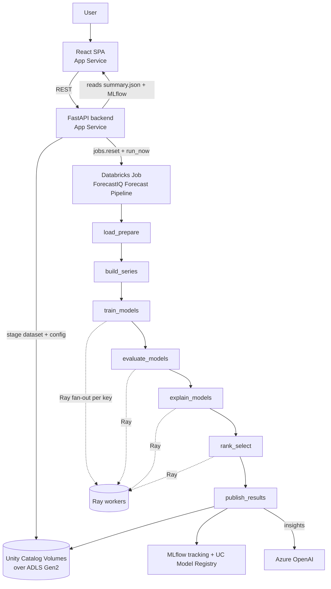

# ForecastIQ — Project Memory / Handover Document

> **Purpose.** A technical knowledge base for an AI coding agent taking over this
> project with no access to prior conversation. Everything here was verified
> against the actual repository, the live Databricks workspace, and the live Azure
> subscription on **2026-09-03** unless explicitly marked otherwise.
>
> **Status vocabulary used throughout:**
> `IMPLEMENTED + VERIFIED` · `IMPLEMENTED + LOCAL VERIFICATION ONLY` ·
> `NOT IMPLEMENTED` · `BLOCKED` · `INTENTIONALLY SKIPPED` · `UNVERIFIED`
>
> **No secret values appear in this file.** Only names, locations and consumers.

---

## 1. Project Overview

**Name:** ForecastIQ — "Intelligent Forecast Model Selection & Validation Platform".

**Business purpose.** A user uploads a time-series dataset. The platform trains
several candidate forecasting models *per business key*, backtests them, screens
them for forecast-quality violations, checks drift, explains them, ranks them,
and selects exactly **one production model per key** — falling back to a baseline
when no candidate survives. It produces auditable evidence for that decision, not
just a forecast.

**What a user does (UI flow, 6 steps):**
1. **Upload** a CSV.
2. **Profile** — the backend inspects columns, dtypes, null %, distinct counts.
3. **Map columns** — date column, target column, business key column(s), features.
   The backend's Validation Engine judges whether the mapping is forecastable.
4. **Configure** — candidate models, fallback model, horizon, derived features.
5. **Compute** — Existing Compute (an all-purpose cluster) or New Job Compute.
6. **Estimate & Run** — submits the run; results appear on their own.

**What the platform produces:** a forward forecast per key, a per-key model
decision with reasons, backtest/forward-validation metrics, SHAP explainability,
drift statistics, an LLM-written business narrative, a registered MLflow model
version per key, and a complete run summary artifact.

**Role of each platform component:**

| Component | Role |
|---|---|
| **Azure App Service** | Hosts the FastAPI backend and the built React frontend. |
| **Databricks** | Executes the forecasting pipeline as a 7-task job. |
| **Ray** | Parallelises *forecast keys* inside a single Databricks task. |
| **Unity Catalog volumes** | Durable storage for datasets, models, forecasts, artifacts. |
| **ADLS Gen2** | The physical storage behind those external volumes. |
| **MLflow** | Experiment tracking (audit) + Model Registry (production lineage). |
| **Azure OpenAI** | Generates per-key business insight narratives. |



---

## 2. Repository Structure

Repo root: `/home/sigmoid/Documents/tech_demo`. **420 tracked files, 1.60 MiB packed.**

| Path | Status | Purpose |
|---|---|---|
| `backend/app/` | ACTIVE | FastAPI backend (78 tracked files). |
| `forecast_engine/` | ACTIVE | Standalone pipeline package (119 files), installed as a wheel on Databricks. |
| `frontend/` | ACTIVE | React + Vite + Tailwind SPA (113 files). |
| `tests/` | TEST-ONLY | 58 backend + 40 engine test files (one engine test still untracked). |
| `databricks/` | ACTIVE | Asset Bundle (`databricks.yml`) + `.env.example`. |
| `.github/workflows/` | ACTIVE | `ci.yml`, `deploy-app.yml`, `deploy-databricks.yml`. |
| `.gitlab-ci.yml` | ACTIVE (unused) | Mirrors CI for GitLab. Nothing runs it yet. |
| `Dockerfile` | ACTIVE | DCS runtime image (environment only, not the app). |
| `pyproject.toml` | ACTIVE | Packages `forecast_engine`; dynamic version. |
| `docs/` | LOCAL-ONLY | **Gitignored** — never reaches any remote. |
| `mlruns/`, `mlflow.db`, `lightning_logs/`, `backend/uploads/`, `.pytest_cache/` | GENERATED | Gitignored scratch; safe to delete. |

### backend/app layout
- `api/` — routers: `auth, compute, deployment, estimation, execution, health, metadata, mlflow_view, profile, results, upload`.
- `config/` — `settings.py` (pydantic-settings), `compute_presets.py`, `model_availability.py`, `run_limits.py`.
- `orchestration/` — `databricks_runner.py` (the big one), `local_runner.py`, `executor.py`, `mlflow_history.py`, `result_mapper.py`, `runner_base.py`, `schemas.py`.
- `services/` — 20+ services: `compute_service`, `deployment_service`, `result_service`, `upload_service`, `validation_engine`, `estimation_service`, `profile_service`, …
- `auth/` — Entra ID token validation + RBAC.

### forecast_engine layout (stage-numbered)
`config/` `core/` `parallel/` `s01_preprocessing` `s02_quality` `s03_storage`
`s04_training` `s05_models` `s06_evaluation` `s07_explainability` `s08_ranking`
`s09_drift` `s10_selection` `s11_llm` (26 files) `s12_tracking` `utils/`
plus `run_pipeline.py` (CLI entry point) and `_version.py`.

---

## 3. End-to-End Execution Flow

1. **Upload** → `POST /upload` → `UploadService` stores the file locally *and* stages
   it to the uploads volume. Returns a `file_id`.
2. **Profile** → `POST /profile` → column dtypes, sample values, null %, distinct counts.
3. **Validate mapping** → `POST /metadata/validate` → Validation Engine returns checks,
   forecast suitability and `ready_for_deployment`.
4. **Compute** → `GET /compute/options` (presets) and `GET /compute/existing`
   (live cluster list) → `POST /compute/validate` or `/compute/existing/validate`.
5. **Deploy** → `POST /deploy` → `DeploymentService.deploy`:
   - refuses unsupported model/compute combinations and unknown runtimes,
   - `PipelineExecutor.execute` → `DatabricksRunner.submit`.
6. **Submit (background thread)** — staging uploads the dataset byte-for-byte to the
   uploads volume (a 17.3 MB dataset measured 56.97 s), writes
   `forecast_configuration.json`, ensures the named job exists, then `run_now`.
   `/deploy` returns in milliseconds with the `run_id`; **the Databricks run id does
   not exist yet at that moment.**
7. **Databricks** runs the 7-task DAG (Section 4).
8. **Poll** → `GET /deployments/{run_id}` merges the in-memory record with the live
   Databricks run state and the engine's `live_status.json`.
9. **Results** → `GET /results/{run_id}` reads `summary.json` from the artifacts volume.

Run id format: `dbx-run-<12 hex>`.

---

## 4. Databricks Workflow

**Verified live**: Job `968418049567321`, name **"ForecastIQ Forecast Pipeline"**,
`max_concurrent_runs: 1`, job parameters `dataset, config, summary_out, live_status_out`.

All seven tasks are `python_wheel_task` (package `forecast_engine`, entry point
`forecast-engine`) chained by `depends_on`, **all attached to one shared job cluster**
`forecastiq_pipeline` (or to the user's existing cluster).

| Task | Purpose | Ray | MLflow | LLM |
|---|---|---|---|---|
| `load_prepare` | Load dataset, quality checks, preprocess, persist curated | No | begin() opens the run | No |
| `build_series` | Group generation + per-key series construction | No | No | No |
| `train_models` | Train every candidate per key | **Yes** | No | No |
| `evaluate_models` | Backtest + forward validation + drift | **Yes** | No | No |
| `explain_models` | SHAP explainability | **Yes** | No | No |
| `rank_select` | Rank candidates, pick production model / fallback | **Yes** | No | No |
| `publish_results` | Forecast export, artifacts, metrics, registry, insights | No | **Yes** | **Yes** |

Each task is invoked with `--stage <task_key>`, so the DAG node name and the engine
phase can never drift.

### Databricks parallelism vs Ray parallelism — read this carefully

- **Databricks task parallelism: NONE by design.** The seven tasks are strictly
  sequential (`depends_on`). Each stage must fully complete for *every* key before
  the next begins. This is the "stage barrier".
- **Ray parallelism: inside a single task.** Within `train_models`, all keys are
  submitted as Ray tasks at once and run concurrently across available CPUs.

The DAG is the *orchestration* graph. It is deliberately **not** one Databricks task
per forecast key — hundreds of tasks would mean hundreds of cluster scheduling
operations and an unreadable graph.

---

## 5. Ray Execution

`forecast_engine/parallel/ray_executor.py`, class `StagedKeyExecution`.

- Four remote functions, each declared `@ray.remote(num_cpus=1)`:
  `_remote_train`, `_remote_evaluate`, `_remote_explain`, `_remote_rank_select`.
- `_start_ray()` attaches to an existing cluster (`address="auto"`) or initialises
  locally with `include_dashboard=False`.
- Collection loop uses `ray.wait(waiting, num_returns=1)` — results are consumed as
  they finish, not in submission order.
- Telemetry per task: start/end offsets, `worker_id`, `node_id`; peak concurrency is
  computed by `_peak_overlap`.
- Falls back to sequential execution (`_run_stage_local`) when Ray is unavailable.

### Worked example — 5 keys, 2 CPUs, `train_models`

1. All 5 tasks are submitted immediately; Ray queues them.
2. 2 start (CPU limit); 3 remain queued.
3. As each finishes, its CPU is reused by the next queued key — worker reuse is
   visible in telemetry (fewer distinct `worker_id`s than keys).
4. `ray.wait` returns each result as it lands; failures are recorded per key in
   `failed_keys` and do **not** abort the stage.
5. **The stage does not return until all 5 have finished.** `evaluate_models` — a
   separate Databricks task — starts only after `train_models` succeeds.

**Serialization boundary.** Objects crossing into Ray workers are pickled.
`_prepare_trained_models_for_pickling` exists because TFT/Lightning models hold
unpicklable back-references (`_trainer` is set to `None` before pickling).

**Snapshot/resume.** `StagedKeyExecution.snapshot()` returns a plain dict;
`StagedKeyExecution.resume(config, snapshot)` rebuilds it in the next task's process.
**Ray object references are never persisted** — only completed per-key results.

---

## 6. Checkpoint Architecture

`forecast_engine/core/checkpoint.py`.

- **Why:** each phase is a separate Databricks task = separate process (sometimes a
  separate container). Nothing in memory survives.
- **Written by:** the driver, after every phase, via `checkpoint.save(context, artifacts_root)`.
- **Read by:** the next task's process, via `checkpoint.load(artifacts_root, run_id)`.
- **Path:** `<artifacts_root>/<run_id>/checkpoint.pkl` (constant `CHECKPOINT_FILENAME`).
- **Format:** pickle of a *shrunk* `PipelineContext` plus the `StagedKeyExecution` snapshot.
- **Explicitly NOT inside:** the prepared DataFrame (re-read from the curated volume)
  and any live Ray handle.
- **Never** passed through task parameters — it travels through the same artifacts
  storage as every other run output.

Three distinct state layers — do not conflate them:

| Layer | Lifetime | Location |
|---|---|---|
| In-memory `PipelineContext` | One task | Process memory |
| Persisted checkpoint | Across tasks of one run | `artifacts_files/runs/<run_id>/checkpoint.pkl` |
| Final result artifacts | Permanent | `summary.json`, forecasts, models, MLflow |

MLflow needs its own handoff: task 1 calls `begin()`, later tasks call
`self._tracking_pipeline.resume(context.tracking_result.run_id)` because MLflow's
fluent active-run state is process-global.

---

## 7. Storage Architecture

**Five UC external volumes** in `forecastiq.forecasting`, all EXTERNAL, all owned by
a personal Databricks account (see §23), all backed by ADLS containers on
`stforecastiq13627` — **verified live**:

| Volume | ADLS location | Contents |
|---|---|---|
| `forecast_files` | `abfss://uploads@stforecastiq13627.dfs.core.windows.net/` | **The user's original uploaded file only.** |
| `curated_files` | `abfss://curated@…/app` | Preprocessed/curated dataset. |
| `models_files` | `abfss://models@…/app` | Winning model artifacts. |
| `forecasts_files` | `abfss://forecasts@…/app` | Forecast CSV export. |
| `artifacts_files` | `abfss://artifacts@…/app` | Run metadata, checkpoint, summary. |

> **Naming trap.** The uploads volume is physically named **`forecast_files`**, not
> `upload_files`. A rename was attempted and **BLOCKED** (the service principal lacks
> `MANAGE`; owner is a personal account). A previous attempt to change the default to
> `upload_files` caused a **production outage** — every upload failed because the
> volume did not exist. The setting `databricks_volumes_root` must keep naming the
> volume that actually exists.

**Verified path construction** (`_output_root` in `databricks_runner.py`):
`<volume_root>/runs` — the writer appends `<run_id>`.

```
/Volumes/forecastiq/forecasting/forecast_files/runs/<run_id>/<original_filename>
/Volumes/forecastiq/forecasting/curated_files/runs/<run_id>/
/Volumes/forecastiq/forecasting/models_files/runs/<run_id>/
/Volumes/forecastiq/forecasting/forecasts_files/runs/<run_id>_forecast.csv
/Volumes/forecastiq/forecasting/artifacts_files/runs/<run_id>/
```

Files observed in `artifacts_files/runs/<run_id>/`:
`summary.json`, `checkpoint.pkl`, `forecast_configuration.json`, `live_status.json`,
`registry.json`, `business_insights.json`.

**Why this shape:** one volume per *kind* of data with a `runs/<run_id>/` prefix means
a future chatbot can retrieve everything about one run by a single key, and the raw
upload is never mixed with derived output.

---

## 8. summary.json

Built by `PipelineContext.summary()`; written by `run_pipeline.py` to
`args.summary_out`. It is **the canonical run record** — the backend rebuilds a past
run entirely from it.

Verified top-level fields:
`run_id, dataset_path, configuration, frequency, mode, group_count, series_count,
forecast_groups, quality_report, preprocessing_summary, curated_dataset_uri,
model_storage_results, forecast_export_result, artifacts_mirror_result,
selected_models, fallback_model, derived_features, training_report,
evaluation_report, explainability_report, ranking_report,
production_selection_report, insight_report, llm_trace, tracking_result,
started_at, completed_at, metadata, stages`.

Also logged into MLflow at artifact path `run/summary.json`
(`SUMMARY_ARTIFACT_PATH`), which is how `MLflowHistoryStore` reconstructs history
after a backend restart.

---

## 9. Azure Architecture (verified via Azure CLI)

Subscription tenant `7388a08a…`.

### rg-forecastiq-dev-eastus (eastus)
| Resource | Name | Purpose |
|---|---|---|
| Databricks workspace | `dbw-forecastiq-dev-eastus` | Pipeline execution |
| Storage (ADLS Gen2) | `stforecastiq13627` | Containers: `uploads, curated, models, forecasts, artifacts` |
| Access Connector | `acc-forecastiq-dev-eastus` | **SystemAssigned** identity; UC → ADLS |
| Key Vault | `kv-forecastiq-13627` | Secrets: `azure-openai-api-key`, `databricks-client-secret`, `storage-sas-token` |
| Container Registry | `crforecastiq13627` | DCS image `forecastiq-runtime` |
| Managed identity | `id-forecastiq-app-dev` | App-side identity |
| Managed identity | `id-forecastiq-dbx-dev` | Databricks-side identity |

Storage RBAC: 3 × `Storage Blob Data Contributor` (ServicePrincipal) + 1 (User).

### rg-openai-dev-eastus
- `aoai-forecastiq-dev` (Cognitive Services) — Azure OpenAI, deployment `gpt-4.1-mini`.

### app-forecastiq-backend-prod_group (centralindia)
- `app-forecastiq-backend-prod` — FastAPI backend, Running.
- `app-forecastiq-frontend-prod` — SPA, Running.

### Organization environment
`UNVERIFIED` / out of scope. A separate organization Azure + Databricks environment
exists and work on it was explicitly **stopped**. Nothing here touches it.

---

## 10. Unity Catalog & RBAC

- Catalog `forecastiq` (owner: a personal account, not the SP) → schema `forecasting` → 5 volumes.
- Also present: `dbw_forecastiq_dev_eastus_7405615696929344` (the workspace default
  catalog). **This is where MLflow model registration actually lands** — see §13.

**Groups (verified live):** `ForecastIQ-Admins`, `ForecastIQ-DataScientists`,
`ForecastIQ-Analysts` — **all three currently have 0 members**.
Intended: Admins = manage; DataScientists = run + read; Analysts = read.
`IMPLEMENTED (groups exist, referenced in settings) + membership NOT IMPLEMENTED`.

**Service principal:** `sp-forecastiq-cicd`. Its application id is deliberately NOT
recorded here — `databricks.yml` keeps `cicd_service_principal_id` defaultless for the
same reason (the id identifies the tenant). Read it from `DATABRICKS_CLIENT_ID`.
It is the CI/CD identity *and* the backend runtime identity.

---

## 11. Compute

**Presets** (`compute_presets.py`):
- Nodes: `Standard_DC4as_v5` (4 vCPU/16 GB, **default**), `Standard_F4ads_v7` (4/16),
  `Standard_E4ads_v7` (4/32, memory optimised), `Standard_F8ads_v7` (8/32).
- Runtimes: `15.4.x-cpu-ml-scala2.12` (default), `16.4.x-cpu-ml-scala2.12`.

**Existing Compute discovery** (`compute_service.list_existing_compute`) — one
`clusters.list()` call, then filters:
1. `_is_all_purpose` — excludes sources `JOB, PIPELINE, PIPELINE_MAINTENANCE`,
   names starting with `forecastiq-validation` (probes), and clusters tagged
   `forecastiq_run_id`.
2. `_incompatibility` — excludes a cluster whose `single_user_name` is a **different**
   principal, and any non-ML runtime (`use_ml_runtime` OR `"ml"` in `spark_version`).
3. State must be usable (`RUNNING/PENDING/RESIZING/RESTARTING`) or startable (`TERMINATED`).

**Dedicated-to-SP pattern.** The real cluster `forecastiq-ray-dev` is
`data_security_mode=SINGLE_USER`, `kind=CLASSIC_PREVIEW`, `use_ml_runtime=True`,
`single_user_name = <the SP's application id>`, created by a human. The creator is
irrelevant; `single_user_name` governs who may attach.

Capacity for a TERMINATED cluster comes from the node-type catalog, because
`cluster_cores`/`cluster_memory_mb` are only populated while RUNNING.

**Cluster policies present:** Personal Compute, Power User Compute, Shared Compute,
Job Compute, Legacy Shared Compute — none are applied by this application.

---

## 12. Model Availability

- Candidates: `prophet, arima, lightgbm, xgboost, tft`. Fallback: `seasonal_naive`.
- `CONTAINER_ONLY_MODELS = {"tft"}` — TFT needs torch + pytorch-forecasting (~900 MB),
  supplied only by the DCS image.
- `unsupported_models(model_ids, uses_container)` refuses **only** the blocked model,
  with a reason naming it.
- `compute_rejection_reason` is a blanket refusal of Existing Compute, gated by
  `databricks_require_container_runtime` — **now defaults to `False`**. It shipped as
  `True`, which disabled Existing Compute entirely wherever an image was configured.

**A model the user selected is never silently dropped.** A run that quietly omits a
chosen model is indistinguishable from one where the model lost — the request is
refused with a reason instead.

---

## 13. MLflow

- Experiment: `/forecast-engine` (id `2071879214528036`). Also present:
  `/Shared/forecastiq/forecast-engine` and four older `forecastiq-ray-poc*` experiments.
- Tracking URI resolves to `databricks` when unset in `databricks` execution mode
  (`mlflow_tracking_uri_resolved`).
- **Registry backend is Unity Catalog** (`databricks-uc`) — *not* the workspace
  registry, which holds 0 models. UC auto-qualifies a two-level name to
  `<workspace-catalog>.default.<name>` and **lowercases it**. 47 `forecast_engine-*`
  models currently exist there.
- Registered model name: `{prefix}-{dataset_slug}-{key_slug}`, stable per business
  key across runs; each run adds **one version** to each key's model.
- Version tags: `forecast_group, model_name, fallback_used, selection_status, run_id`.
  `search_model_versions` on UC returns a row type whose `.tags` is a **bound method**;
  use `get_model_version` to read tags.
- Registration is parallel (`registration_max_workers`, default 8) and each worker
  must call `client.attached_run(run_id)` — MLflow's fluent active-run stack is
  thread-local, and without it `log_model` starts its own orphan run.

**Tracking ≠ Registry.** Tracking is the audit record (params/metrics/artifacts);
the Registry is production lineage. Do not delete tracking to make publish faster.

---

## 14. LLM / Azure OpenAI

- Provider: Azure OpenAI only; no provider abstraction. Deployment `gpt-4.1-mini`.
- Prompts are versioned files under `forecast_engine/s11_llm/prompts/v1|v2`;
  active version via `LLM_PROMPT_VERSION` (default `v2`).
- Output is schema-validated and **grounded** against real metrics; failures fall back
  to a deterministic template (`template_fallback.py`).
- **Credential delivery (both compute modes, one path):** the backend sends only the
  *scope name* as a task parameter `--databricks-secret-scope <scope>`. The engine
  calls `dbutils.secrets.get` on the cluster
  (`forecast_engine/core/databricks_secrets.py::load_azure_openai_from_scope`).
  A task parameter reaches an existing cluster; a cluster env var does not.
- Secret scope `forecastiq` (backend `DATABRICKS`) holds
  `azure-openai-endpoint`, `azure-openai-api-key`, `azure-openai-deployment`
  (plus `acr-username`, `acr-password`).
- Failures raise `SecretResolutionError` naming only scope and key, with `from None`
  so the cause cannot leak into a traceback. Missing credentials → template insights,
  never a failed forecast.

---

## 15. Configuration Audit

All backend settings live in `backend/app/config/settings.py` (pydantic-settings,
`extra="ignore"` — **unknown env vars are silently dropped**, which has caused an
outage before).

**Key settings** (name · default · consumer):

| Setting | Default | Notes |
|---|---|---|
| `EXECUTION_MODE` | `local` | `local` / `databricks` / `databricks_dcs` |
| `DATABRICKS_HOST/CLIENT_ID/CLIENT_SECRET` | none | SP auth (secret) |
| `DATABRICKS_JOB_DISPLAY_NAME` | `ForecastIQ Forecast Pipeline` | job lookup key |
| `DATABRICKS_SECRET_SCOPE` | `forecastiq` | LLM credentials |
| `DATABRICKS_ENGINE_WHEEL_PATH` | none | **point at the artifact DIRECTORY** |
| `DATABRICKS_REQUIRE_CONTAINER_RUNTIME` | `False` | opt-in container-only |
| `DATABRICKS_VOLUMES_ROOT` | `…/forecast_files` | uploads (legacy name kept) |
| `DATABRICKS_{CURATED,MODELS,FORECASTS,ARTIFACTS}_VOLUMES_ROOT` | per-volume | outputs |
| `MLFLOW_TRACKING_URI/REGISTRY_URI/EXPERIMENT_NAME` | none | resolvers supply defaults |
| `AZURE_OPENAI_*` | none | **local mode only**; cloud uses the secret scope |
| `AUTH_ENABLED` | `False` | refuses to start `False` outside dev/local/test |
| `CORS_ORIGINS` | `["http://localhost:5173"]` | must include the frontend origin |

**Live App Service settings (names only, verified):** includes `DATABRICKS_JOB_ID` and
`DATABRICKS_EXISTING_CLUSTER_ID` — **DEPRECATED**: no corresponding fields exist in
`Settings` any more, so `extra="ignore"` drops them silently. Harmless but misleading;
they should be removed.

**Frontend:** only `VITE_API_BASE_URL` (single source of truth in `apiConfig.js`,
localhost fallback for `npm run dev`).

**Rule:** environment-specific values come from configuration; true algorithmic
constants (horizon bounds, model registry entries, stage names) stay code constants
and are kept in lockstep with the engine by tests that read the engine's source text.

---

## 16. Authentication / RBAC

```
User → Entra ID (SPA client) → access token (audience = API client)
     → backend validates with the tenant's PUBLIC signing keys
     → role from app role or ENTRA_GROUP_ROLE_MAP
     → Admin | DataScientist | Analyst
```
The backend holds **no Entra credential of its own**. With `AUTH_ENABLED=false` it
issues a local development identity (`DEV_IDENTITY_ROLE`) and refuses to start unless
`APP_ENV` is development/local/test.

Databricks/UC access is **not** per end user — the backend acts as
`sp-forecastiq-cicd` for every run. `started_by` is server-derived from the
authenticated principal and can never be spoofed by a client.

---

## 17. CI/CD

### GitHub Actions (authoritative — this is what deploys)
- **`ci.yml`** — 5 jobs: backend-tests, engine-tests, frontend-build,
  package-validate (build wheel + import from a clean venv),
  databricks-bundle-validate (skips cleanly when credentials absent).
- **`deploy-app.yml`** — Azure **OIDC federation** (`id-token: write`,
  `azure/login@v2`), deploys backend + frontend App Services.
- **`deploy-databricks.yml`** — sets `FORECAST_ENGINE_VERSION: 0.1.0+ci.${{ github.run_number }}`,
  builds the wheel, `bundle validate -t prod`, `bundle deploy -t prod`.

**GitHub secrets used:** `AZURE_SUBSCRIPTION_ID`, `AZURE_TENANT_ID`,
`APP_SERVICE_RESOURCE_GROUP`, `BACKEND_APP_NAME`, `BACKEND_HOSTNAME`,
`FRONTEND_APP_NAME`, `FRONTEND_HOSTNAME`, `DATABRICKS_HOST`,
`DATABRICKS_CLIENT_ID`, `DATABRICKS_CLIENT_SECRET`.

Bundle deploy target (verified live):
`/Workspace/Users/<sp-app-id>/.bundle/forecastiq/prod/` — `artifacts/.internal/` holds
exactly one wheel (`forecast_engine-0.1.0+ci.54-py3-none-any.whl`).

### GitLab (`.gitlab-ci.yml`) — prepared, never executed
Mirrors `ci.yml`'s five jobs only. **It does NOT deploy** — deployment stays on
GitHub so two platforms can never both deploy to the same App Service and workspace.

Required before a GitLab pipeline can pass: project CI/CD variables
`DATABRICKS_HOST`, `DATABRICKS_CLIENT_ID`, `DATABRICKS_CLIENT_SECRET`
(masked + protected), and a **Docker-executor runner**.
Status: `IMPLEMENTED + UNVERIFIED` — never run, needs a runner.

**GitHub and GitLab CI are entirely independent.** GitLab does not read `.github/`.

---

## 18. Git State (2026-09-03)

- Branch `main`; `origin` = GitHub (`Avinash3003/Intelligent_forecaste_model…`),
  `gitlab` = `gitlab.sigmoid.com/devops/intelligent_forecaste_model` (**never pushed**).
- `origin/main` == local `main` == `c260986` (0 ahead / 0 behind).
- Recent commits: `c260986` wheel resolution · `0b97bc5` GitLab CI ·
  `de2e7b0` PII removal · `390269d` Ray timeline redesign ·
  `84f18f0` publish optimisation · `c259bb0` wheel version stamping.

**Uncommitted at time of writing:**
- `forecast_engine/s05_models/tft_model.py` — `lightning_logs` fix (§20).
- `tests/engine/test_tft_writes_no_scratch_files.py` — new test (untracked).
- `forecast_engine/requirements.txt` — **NOT an intended edit**; `pip wheel` rewrites
  this file and strips its comments. Revert with `git checkout --` before committing.

---

## 19. Testing

- **588 backend tests**, **443 engine tests**, frontend builds clean.
- No frontend test framework exists — `INTENTIONALLY SKIPPED` so far.
- Tests are directory-independent (a conftest pin plus `__file__`-anchored paths);
  a guard test fails if a working-directory-relative path is reintroduced.

| Area | Status |
|---|---|
| Backend units/services | TESTED |
| Engine stages, Ray, checkpoint | TESTED |
| MLflow registration + idempotency | TESTED (unit) + real-run verified |
| LLM secret resolution | TESTED (fakes) + real-run verified both compute modes |
| Existing Compute end-to-end | TESTED (real runs) |
| New Job Compute end-to-end | TESTED (real run `dbx-run-54fca681ab29`) |
| Wheel resolution | TESTED + real-run verified |
| Publish at 500 keys | PARTIALLY TESTED (12 keys verified; 500 observed, not profiled) |
| Frontend UI | PARTIALLY TESTED (build + manual screenshots, light mode only) |
| GitLab pipeline | NOT TESTED |

---

## 20. Important Bugs Found and Fixed

1. **Volume rename outage.** Default changed `forecast_files` → `upload_files`; the
   volume did not exist; every upload failed. *Fix:* restore the field + resolver;
   defaults must name volumes that exist. *Regression risk:* HIGH — never rename.
2. **MLflow tracking never resumed** in checkpointed tasks → publish reported "no run
   open", 0 models registered. *Fix:* `resume(run_id)` in later phases.
3. **Raw vs resolved MLflow settings.** `_engine_cluster_env` forwarded the *raw*
   blank `MLFLOW_TRACKING_URI`; the engine fell back to local sqlite inside the
   container while the backend read the workspace store — finished runs never appeared.
   *Fix:* forward `*_resolved`.
4. **LLM silently template-only on Databricks.** Credentials reached the local
   subprocess but not the cluster. *Fix:* secret-scope name as a task parameter,
   resolved on-cluster. *Verified:* `provider: azure_openai` on both compute modes.
5. **Existing Compute disabled everywhere.** `databricks_require_container_runtime`
   shipped defaulting `True`. *Fix:* default `False`; only TFT is refused, by name.
6. **Per-run all-purpose clusters.** `jobs.submit` created an ordinary cluster per run.
   *Fix:* named job + real `job_clusters`.
7. **Publish 75 min / 100 versions in one run.** One registered model per *dataset*,
   one version per *key*, registered sequentially at ~29 s each.
   *Fix:* per-key stable names + bounded parallelism (383 s → 39.5 s for 8 keys) +
   run-tag idempotency. *Regression introduced and fixed during this work:*
   parallel `log_model` created **24 orphan MLflow runs** because the fluent
   active-run stack is thread-local — fixed with `attached_run`.
8. **Model artifact required the internal wheel.** The pyfunc wrapper pickled *by
   reference*, so every version needed `forecast_engine` installed (hence the
   "not found in public PyPI" warning). *Fix:* wrapper moved to its own module and
   registered for by-value cloudpickling; verified it loads with the package absent.
9. **Stale wheel on long-lived clusters.** pip skips a version already installed, so
   Existing Compute ran months-old code. *Fix:* CI stamps `0.1.0+ci.<run_number>`.
10. **Broken wheel path (caused by #9).** The job referenced a fixed filename while the
    bundle published a stamped one → `ERROR_NO_SUCH_FILE_OR_DIRECTORY`, cluster
    terminated. *Fix:* `_resolve_engine_wheel` resolves from the artifact directory,
    ordered by PEP 440 version (`'+' < '-'`, so name-sorting picks the stale wheel).
11. **Run history "No runs yet".** `list_runs` returns `[]` while the MLflow sweep is
    warming; Results/Dashboard fetched once. *Fix:* shared `useRunHistory` hook retries.
12. **Stale deploy-error banner** persisted after changing compute. *Fix:* clear on navigation.
13. **Test isolation.** Running pytest from `backend/` loaded the developer's real
    `.env`; from `forecast_engine/` three checks silently *skipped*, including
    "the Dockerfile mentions no secrets". *Fix:* conftest pin + `__file__` anchoring.
14. **`lightning_logs` pollution.** `pytorch_forecasting`'s `BaseModel.predict` builds
    its **own** Trainer with the default logger — one `lightning_logs/version_N` per
    prediction (170 accumulated locally; hundreds per 500-key cloud run). *Fix:* one
    shared `_QUIET_TRAINER` config applied to both the training and prediction Trainers.
    *Status:* `IMPLEMENTED + LOCAL VERIFICATION ONLY` — uncommitted, not yet deployed.
15. **Credential exposure incident.** While testing secret resolution, a real Azure
    OpenAI key prefix (~39 chars) was printed into a terminal transcript, because
    `databricks.sdk.runtime` resolves secrets off-Databricks when SDK credentials are
    present. **The key in scope `forecastiq` / `azure-openai-api-key` should be
    rotated.** `NOT DONE`.
16. **PII in test fixtures.** A colleague's email and the real Entra `onmicrosoft`
    domain had been copied from live output into tests. *Fix:* anonymised.

---

## 21. Current State

| Feature | Status | Verification | Notes |
|---|---|---|---|
| Upload → profile → validate → configure | DONE | Real runs | |
| 7-task Databricks DAG | DONE | Live job inspected | Shared job cluster |
| Ray key parallelism | DONE | Telemetry from real runs | Stage barrier honoured |
| Checkpoint handoff | DONE | Real multi-task runs | |
| Storage separation (5 volumes) | DONE | Live UC inspection | uploads volume still named `forecast_files` |
| Existing Compute | DONE | Real runs | SP-dedicated clusters only |
| New Job Compute | DONE | `dbx-run-54fca681ab29` | |
| DCS container execution | DONE | Image `crforecastiq13627.azurecr.io/forecastiq-runtime:latest` | |
| TFT | DONE | Container-only, refused by name elsewhere | |
| MLflow tracking | DONE | 206 params / 435 metrics / 10 artifact dirs | |
| Model registry (per key) | DONE | UC, 12 keys × 3 runs verified | |
| Publish idempotency | PARTIALLY DONE | Run-tag markers verified on a real run | Marker written after registration |
| LLM insights | DONE | `provider: azure_openai`, both modes | |
| Wheel version stamping + resolution | DONE | Real run | |
| Entra auth + RBAC | PARTIALLY DONE | Code tested | Groups exist, **0 members** |
| GitLab CI | UNVERIFIED | YAML validated only | No runner |
| Volume rename to `upload_files` | BLOCKED | SP lacks MANAGE | |
| Organization Azure/Databricks migration | NOT IMPLEMENTED | — | Deliberately stopped |
| Chatbot / retrieval | NOT IMPLEMENTED | — | Storage shaped for it |
| Frontend test framework | INTENTIONALLY SKIPPED | — | |

---

## 22. Cleanup History

Removed (established from this project's own history):
- Repo/local: `mlruns/`, `mlflow.db`, `lightning_logs/` (×2), `backend/uploads/*`
  (155 MB of staged copies), `.pytest_cache/`, `build/`, `dist/`, `*.egg-info/`,
  `frontend/dist/`, `__pycache__/`, an empty `databricks/resources/`, a redundant
  `databricks/.gitkeep`, `.claude/`, a stale `.env.bak` that contained live secrets.
- Dead frontend code: `ExplainabilityCard.jsx`, `ModelDecisionCard.jsx` (368 lines).
- Databricks: throwaway probe registered models (`zz_perf_*`, `zz_idem_*`,
  `perf_multikey`) and a scratch validation-wheel workspace folder, all created by
  verification work and deleted afterwards.

Deliberately preserved: `docs/` (gitignored, local reference), the `forecastiq-ray-poc*`
MLflow experiments, the `forecastiq-ray-dev` cluster, and all user datasets in UC.

---

## 23. Known Problems

**Confirmed:**
- `publish_results` is still the dominant stage at scale: **29 min for 500 keys**
  (down from 74 min). Registration is parallel; **LLM insight generation inside publish
  appears to be sequential per key** and is the likely remaining bottleneck.
- The default node `Standard_DC4as_v5` (16 GB) causes **Ray OOM worker kills** on
  500-key runs with TFT. `Standard_E4ads_v7` (32 GB) does not.
- MLflow logs `Failed to end span … 'MlflowSpanProcessor' object has no attribute
  '_metrics'` repeatedly during publish — cosmetic, from MLflow's tracing layer.
- `pip wheel` rewrites `forecast_engine/requirements.txt`, stripping its comments.
- Deprecated App Service settings (`DATABRICKS_JOB_ID`, `DATABRICKS_EXISTING_CLUSTER_ID`)
  are silently ignored by `extra="ignore"`.
- `DATABRICKS_ENGINE_WHEEL_PATH` still names a *filename*; it self-heals but should
  name the directory.
- The Azure OpenAI key needs rotation (§20.15).

**Hypotheses (not confirmed):**
- Publish may be dominated by LLM calls rather than registration at 500 keys —
  needs profiling.
- UC `search_model_versions`/`get_model_version` latency (~3 s each) may matter if any
  future code adds per-key registry lookups.

---

## 24. Performance (measured)

**500-key production run, 5 models incl. TFT** — the two runs differ in *three* ways
(node, runtime, engine version), so only publish is a like-for-like improvement:

| Stage | Before (E4ads_v7 32 GB, 15.4) | After (DC4as_v5 16 GB, 16.4) |
|---|---|---|
| load_prepare | 5m13s | 9m55s |
| build_series | 12.5s | 20.3s |
| train_models | 5m25s | 15m40s |
| evaluate_models | 7m25s | 25m40s |
| explain_models | 4m04s | 10m13s |
| rank_select | 3m56s | 4m47s |
| **publish_results** | **1h14m50s** | **29m03s** |

Non-publish stages are 1.9–3.5× slower purely from halved memory + OOM retries.

**Micro-benchmarks (dev workspace):**
- `log_model` without registration 17.4 s; with registration 29.0 s.
- Artifact payload is 5 files, ~3 KB → cost is per-call overhead, not data volume.
- Registration, 8 keys: sequential 383.1 s → 8 workers 39.5 s (**9.7×**).
- Publish retry (idempotent): 71 s → **1.9 s**, 0 new versions.
- 12-key run publish: 69–87 s.
- Cold job-cluster start ≈ 350–450 s; the estimator's fallback constant is 396 s.

---

## 25. Future Roadmap

**HIGH**
- Profile and optimise LLM insight generation in `publish_results` (likely sequential).
- Rotate the exposed Azure OpenAI key.
- Commit + deploy the `lightning_logs` fix.
- Make `DATABRICKS_ENGINE_WHEEL_PATH` a directory; delete deprecated App Service settings.

**MEDIUM**
- Chatbot / structured retrieval over `artifacts_files/runs/<run_id>/`.
- Populate the three Entra/Databricks groups and finish RBAC.
- Record `forecast_engine.__version__` in `summary.json` for runtime provenance.
- Fix `pip wheel` clobbering `requirements.txt`.
- Distinguish "history warming" from "no runs" in the API itself.

**LATER**
- GitLab migration (runner, variables, deploy ownership).
- Organization Azure/Databricks environment.
- Frontend test framework; dark-mode verification.
- Monitoring/alerting.

---

## 26. DO NOT BREAK THESE

1. **Do not rename the uploads volume** or change `databricks_volumes_root` away from
   `forecast_files`. It caused a production outage.
2. **Do not put secret values** in code, logs, API responses, job definitions, tests,
   or this document. Send the *scope name*, never the credential.
3. **Do not collapse the 7-task Databricks DAG** into one task, and **do not** create
   one Databricks task per forecast key.
4. **Do not move Ray parallelism across the stage barrier.**
5. **Do not remove checkpointing** without understanding that each task is a separate process.
6. **Do not silently drop a user-selected model** — refuse with a reason.
7. **Do not bypass compute compatibility validation.**
8. **Do not register per candidate model** — only the final selected model per key.
9. **Do not use the pipeline `run_id` as a registered model name**, and do not put it
   in the name at all; it belongs in version tags.
10. **Do not delete MLflow tracking** to make publish faster.
11. **Do not hardcode** wheel filenames, workspace UUIDs, user paths, or cluster ids.
12. **Do not put datasets in `artifacts_files`, or `summary.json` in the uploads volume.**
13. **Do not call `mlflow` fluent APIs from worker threads** without `attached_run`.
14. **Do not add a second packaging/deployment mechanism** — the bundle builds the wheel.
15. **Do not let GitLab deploy** while GitHub deploys.
16. **Do not delete cloud resources** without explicit confirmation; never touch another
    user's clusters, volumes or bundles.
17. **Do not push or commit** unless explicitly instructed.
18. **Comments: one line, ~10 words maximum.** No large explanatory blocks in production code.
19. **Do not trust `search_model_versions().tags` on Unity Catalog** — it is a method.
20. **Remember `extra="ignore"`** — a typo'd env var is silently dropped, not an error.

---

## 27. How a New AI Should Start

1. Read this file end to end.
2. Inspect the actual repository — it is the source of truth, not this document.
3. Verify live cloud state before reasoning about it (`databricks.sdk` with the SP
   credentials in `backend/.env`; `az` CLI is logged in).
4. Identify which of backend / engine / frontend owns the behaviour you are changing.
5. Reproduce the problem before fixing it. Do not fix from a plausible theory.
6. Make the smallest correct change.
7. Run `pytest tests/backend` and `pytest tests/engine` **from the repository root**.
8. For anything touching Databricks, MLflow, storage or compute, run a **real** job
   and read the artifacts — unit tests cannot catch environment mismatches, and most
   of the bugs in §20 passed their unit tests.
9. When you verify, verify with the *user's own* configuration. Several bugs here
   were masked by an env override set only in the agent's shell.
10. Report exactly what changed, what was verified, and what was not.
11. **Never claim verification that did not happen.**

### Useful commands
```bash
# tests (always from the repo root)
backend/.venv/bin/python -m pytest tests/backend -q
forecast_engine/.venv/bin/python -m pytest tests/engine -q -p no:randomly

# frontend
cd frontend && npm run build

# a local backend against the real workspace
cd backend && AUTH_ENABLED=false .venv/bin/python -m uvicorn app.main:app --port 8000
```
